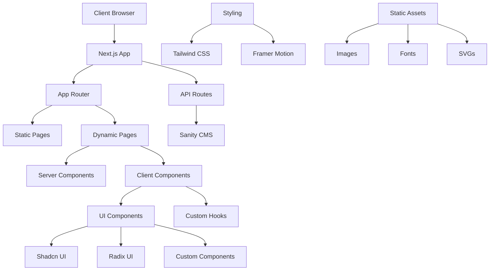

# BlueRedGold

A modern, responsive company website built with Next.js 15, TypeScript, Tailwind CSS and Shadcn. The website features a blog section powered by Sanity CMS and follows best practices for performance, accessibility, and maintainability.

## 🚀 Features

- Modern, responsive design with mobile-first approach
- Server-side rendering with Next.js 15
- Type-safe development with TypeScript
- Modern-looking UI components with Radix UI and Tailwind CSS
- Blog section powered by Sanity CMS
- Contact form with client-side validation and email confirmation (via Brevo)
- Smooth animations with Framer Motion
- SEO optimized
- Accessibility focused

## 📋 Prerequisites

- Node.js 18.x or later
- npm or yarn
- Sanity CLI (for blog management)

## 🛠️ Installation

1. Clone the repository:

```bash
git clone https://github.com/SemuraiAB/blueredgold.git
cd blueredgold
```

2. Install dependencies:

```bash
npm install
# or
yarn install
```

3. Set up environment variables:

```bash
cp .env.example .env
```

Fill in the required environment variables in `.env`:

```
NEXT_PUBLIC_SANITY_PROJECT_ID=your_sanity_project_id
NEXT_PUBLIC_SANITY_DATASET=production
SANITY_API_TOKEN=your_sanity_api_token
NEXT_PUBLIC_BASE_URL=http://localhost:3000 # Or your deployment URL
BREVO_API_KEY=your_brevo_api_key
EMAIL_RECIPIENT=your_admin_email@example.com # Email address to receive contact form notifications
```

4. Run the development server:

```bash
npm run dev
# or
yarn dev
```

The application will be available at `http://localhost:3000`

## 📁 Project Structure

```
blueredgold/
├── .next/
├── node_modules/
├── prisma/
├── public/
│   ├── about/
│   ├── blogs/
│   ├── career/
│   ├── contact-us/
│   ├── esg/
│   ├── food-beverages/
│   ├── illustration/
│   ├── landing-page/
│   ├── medical-cosmetics/
│   ├── press/
│   ├── favicon.ico
│   ├── logo-text.svg
│   ├── logo.svg
│   └── not-found.webp
├── src/
│   ├── app/
│   │   ├── about-us/
│   │   │   ├── about/
│   │   │   ├── career/
│   │   │   ├── contact-us/
│   │   │   ├── investor-relations/
│   │   │   ├── press/
│   │   │   └── sustainability/
|   |   |       ├── esg/
│   │   ├── api/
│   │   │   ├── contact/
│   │   │   └── send-confirmation/
│   │   ├── blogs/
|   |   |   |── articles/
│   │   │   ├── news/
│   │   │   ├── saffron-recipes/
│   │   │   ├── science/
│   │   │   └── updates/
│   │   ├── contact-us/
│   │   │   └── thank-you/
│   │   ├── premium-saffron/
│   │   │   ├── food-beverages/
│   │   │   └── medical-cosmetics/
│   │   ├── privacy-policy/
│   │   ├── studio/
│   │   │   └── [[...tool]]/
│   │   ├── technology/
│   │   │   ├── data/
│   │   │   ├── growing/
│   │   │   └── harvesting/
│   │   ├── globals.css
│   │   ├── layout.tsx
│   │   ├── not-found.tsx
│   │   ├── page.tsx
|   |
│   ├── components/
│   │   ├── animations/
│   │   ├── landing-page/
│   │   ├── ui/
|   |   ├── ClientOnly.tsx
│   │   ├── Footer.tsx
|   |   ├── LayoutWrapper.tsx
|   |   ├── Navbar.tsx
|   |   ├── PortableTextComponent.tsx
│   │   └── ShareButton.tsx
│   ├── fonts/
│   ├── hooks/
|   ├── lib/
│   └── sanity/
├── .env.example
├── .env.local
├── .gitignore
├── .prettierrc
├── components.json
├── eslint.config.mjs
├── next-env.d.ts
├── next.config.ts
├── package-lock.json
├── package.json
├── postcss.config.mjs
├── README.md
├── tailwind.config.ts
└── tsconfig.json
```

## 🏗️ Architecture



## 🛠️ Tech Stack

- **Framework**: Next.js 15
- **Language**: TypeScript
- **Styling**: Tailwind CSS
- **UI Components**: Radix UI, Shadcn UI
- **CMS**: Sanity
- **Email API**: Brevo (Sendinblue)
- **Animations**: Framer Motion
- **Development Tools**: ESLint, Prettier

## 📝 Blog Management

The blog section is managed through Sanity CMS. To manage blog content:

1. Install Sanity CLI:

```bash
npm install -g @sanity/cli
```

2. Start the Sanity Studio:

```bash
npm run sanity
```

3. Access the Sanity Studio at `localhost:3000/studio or domain.com/studio`

## 🚀 Deployment

The application can be deployed to Vercel with the following steps:

1. Push your code to GitHub
2. Connect your repository to Vercel
3. Configure environment variables in Vercel
4. Deploy!

## 📄 License

This project is private and confidential. All rights reserved.
